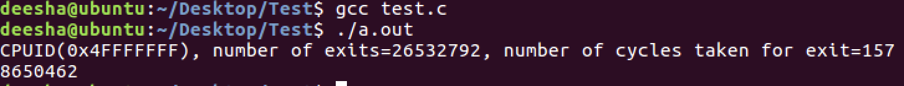

# CMPE-283-Assignment-2
#### Group -
#### Deesha Desai - 015135536
#### Ananth Upadhya - 015234726

#### Assignment
Your assignment is to modify the CPUID emulation code in KVM to report back additional information
when a special CPUID “leaf function” is called.
* For CPUID leaf function %eax=0x4FFFFFFF:
* Return the total number of exits (all types) in %eax
* Return the high 32 bits of the total time spent processing all exits in %ebx
* Return the low 32 bits of the total time spent processing all exits in %ecx
   %ebx and %ecx return values are measured in processor cycles

### For each member in your team, provide 1 paragraph detailing what parts of the lab that member implemented / researched. (You may skip this question if you are doing the lab by yourself).

#### Deesha Desai:
* Compiled the code with the required modifications
* Debugged and made changes to fix the errors which occurred while compiling the code
* Did the setup to creat a nested VM for the test program to run
* Created the documentation.

#### Ananth Upadhya:
* Made required code changes to the cupid.c and vmx.c files
* Investigated on how to perform testing for kernel code
* Wrote the test program
* Updated the documentation

## Steps followed for this assignment:
#### Prequisties:
1. Clone the code for the kernel from GitHub: git clone https://github.com/torvalds/linux.git
2. Build the kernel code:
* sudo bash
* apt-get install build-essential kernel-package fakeroot libncurses5-dev libssl-dev ccache bison flex libelf-dev
* uname -a
  
* Change the .Config file
  cp -v /boot/config-5.4.0-52-generic ./.config
  
*  Make the file - make oldconfig
* make -j
* sudo make modules && sudo make install && sudo make modules_install
* reboot
* Verify the updated Linux version:
    uname -a
  

#### Build
1. The cpuid.c file is modified as below:
     
  In vmx.c module, changes are made to calculate the total number of exits & time spent during exits. All the changes made are preceeded by comment, 'Assigntment-2 changes".
2. Complie the code using – sudo make -j && make modules && make install && make modules_install

#### Setup KVM
1. Check if your processor supports kvm installation using below command:
   kvm-ok
2. Use the following command to install KVM and supporting packages.
   sudo apt-get install qemu-kvm libvirt-daemon-system libvirt-clients bridge-utils
3. Verify KVM Installation using the following command. You should see an empty list of virtual machines. 
  virsh -c qemu:///system list

### Creating and running a nested virtual machine using KVM

1) Download ubuntu iso image.
2) Create a new VM from Virtual Machine Manager application using the ISO image and install Ubuntu. 
3) Run the test.c using following commands:
* gcc test.c
* ./a.out

### Result

1. From test program verified the result

2. From host VM kernal logs below

### Comment on the frequency of exits:

  1. <b> Does the number of exits increase at a stable rate? Or are there more exits performed during certain VM operations? Approximately how many exits does a full VM boot entail?</b>

  *  The number of exits does not increase at a stable rate. Yes more exits are performed during certain VM operations/instructions like EPT violation, I/O instruction, RDTSCP etc.

  * The number of exits after the first build, reboot and entering the nested VM using the KVM is 172,456. This is not very accurate as there might have been a shutdown period and hardware interrupts in-between.

